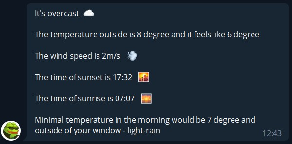

# currency-weather-checker

A simple telegram bot that will send currency rates or weather by request.

How to use:
Change following properties in src/main/resources/application.properties: 
 

bot.name - the name for your bot, you can get one from @BotFather

bot.token - token for HTTP API usage, you also will get it from @BotFather

weather.yandex.header.value - As far as this api uses yandex.pogoda api for getting data about the weather you need your
developer key for using it

geocoding.header.value - developer key for transforming city name in latitude and longitude (you can use api-ninjas or smth else you prefer)

